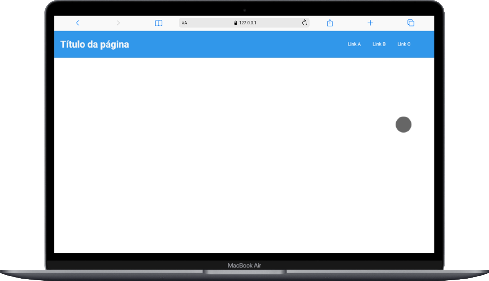
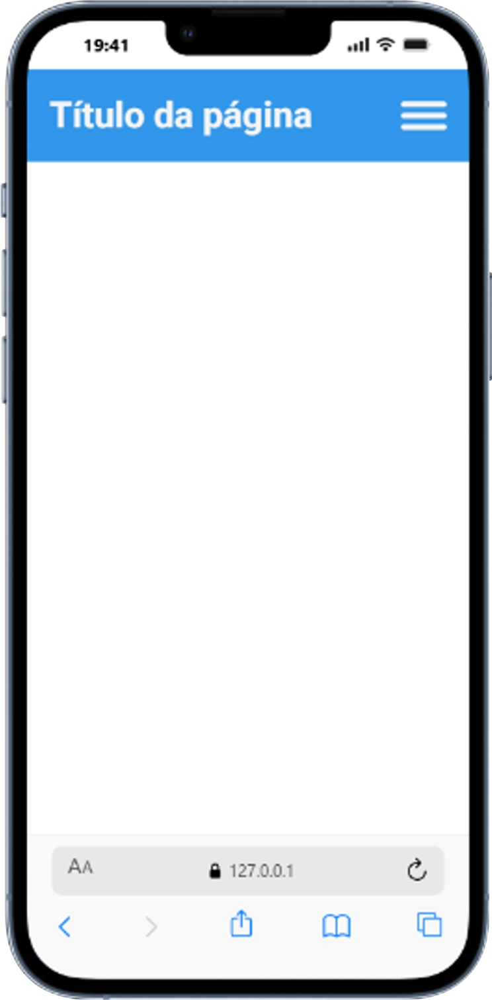

# Cabeçalho simples e responsivo

Este projeto é um **cabeçalho responsivo simples**, desenvolvido apenas para demonstrar a **estrutura básica de um header em websites**.

Ele não possui temática específica. O objetivo foi praticar conceitos de **HTML, CSS e JavaScript**, incluindo animações e responsividade.

---

## 📌 Estrutura do cabeçalho

O cabeçalho possui:

- Um **título posicionado à esquerda**
- **Três links de navegação posicionados à direita**
- Animação de **sublinhado gradual nos links**
- Menu **responsivo para dispositivos móveis**

---

## Funcionalidades

### Animação nos links

Cada link possui um efeito visual criado com **CSS `::after`**:

- Ao passar o mouse, uma **barra aparece abaixo do texto**
- Essa barra **cresce gradativamente até sublinhar o link completamente**

---

### Menu responsivo

Em telas menores:

- Os links do menu são ocultados
- Surge um **botão de menu hambúrguer**

Quando clicado:

- O botão **se transforma em um "X"**
- A animação foi feita utilizando **`rotate: 45deg`**
- Um dos três traços do ícone é ocultado para criar o efeito

---

### Menu lateral

Ao abrir o menu mobile:

- Uma **barra lateral cobre toda a tela**
- Os três links são exibidos em **coluna**
- Cada botão permanece **clicável e destacado**

---

## 📱 Responsividade

O layout adapta-se a diferentes tamanhos de tela:

- **Desktop / notebook**
- **Smartphones**

---

## 🖥️ Visual do projeto

### Versão Desktop

---

### Versão Mobile

---

## 🛠️ Tecnologias utilizadas

- **HTML5**
- **CSS3**
- **JavaScript**

Principais recursos utilizados:

- `flexbox`
- `::after`
- `transform`
- `rotate`
- `transition`
- `media queries`

---

## 🎯 Objetivo do projeto

Este projeto foi desenvolvido com o objetivo de:

- Praticar **estrutura de layout**
- Criar **animações simples com CSS**
- Implementar **responsividade**
- Trabalhar com **menus mobile**

---
